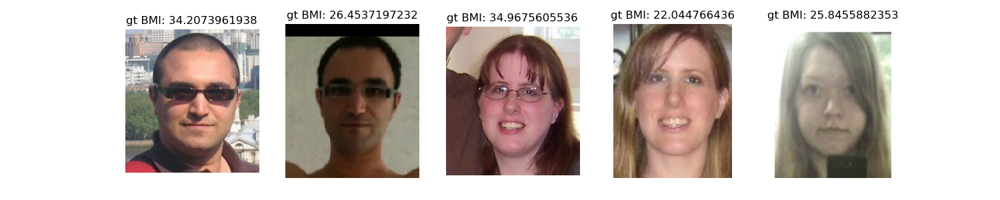
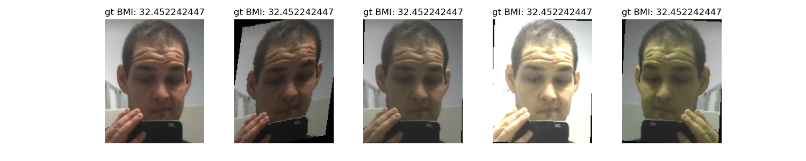

# Face to Body Mass Index
Body mass index (BMI) is a measure of body fat based on height and weight that applies to adult men and women. 
<br>
This project predicts the BMI value with one image of a human face.

## Performance
### Original dataset
With original dataset, after training 10 epoches, the model has a MAE loss of ``3.45`` on the test dataset.

### Augmented dataset
With augmented dataset, still training...


## Installation
1. Clone this repository by running:
```
git clone git@github.com:liujie-zheng/face-to-bmi-vit.git
cd face-to-bmi-vit
```
2. Install conda [here](https://conda.io/projects/conda/en/latest/user-guide/install/index.html).
3. Depending on your operating system, install dependencies by running: 
```
conda env create -f environment_linux.yml
conda activate face2bmi
```
or
```
conda env create -f environment_mac.yml
conda activate face2bmi
```

## Run a demo in terminal
1. (Optional) replace ./data/test_pic.jpg with your own image. Note: for your own image, a face should occupy a substantial part of the image for optimal results.
2. In root directory, run:
```
cd scripts
conda run -n face2bmi --no-capture-output python demo.py
```
if you encounter a ``PermissionError: [Errno 13] Permission denied`` error, instead run:
```
sudo conda run -n face2bmi --no-capture-output python demo.py
```

## Train it by yourself
In root directory, train the original unaugmented dataset by running:
```
cd scripts
conda run -n face2bmi --no-capture-output python run.py
```
or train the augmented dataset by running:
```
cd scripts
conda run -n face2bmi --no-capture-output python run.py --augmented=True
```
